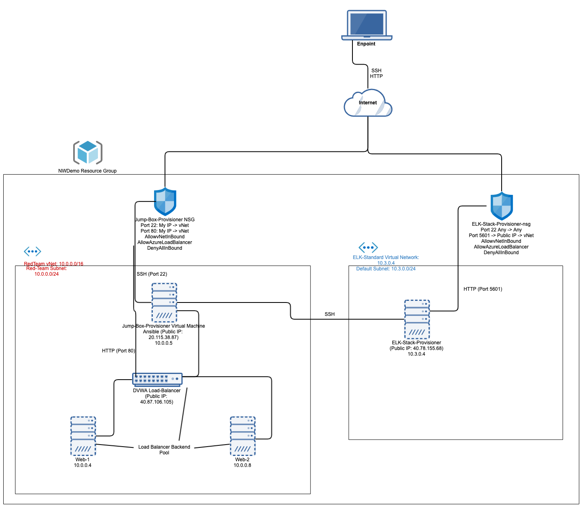
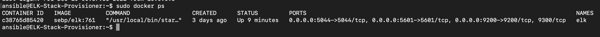

# ELK-Stack
Configuring an ELK stack server to observe a cloud monitoring system.

## Automated ELK Stack Deployment

The files in this repository were used to configure the network depicted below.

These files have been tested and used to generate a live ELK deployment on Azure. They can be used to either recreate the entire deployment pictured above. Alternatively, select portions of the playbook.yml file may be used to install only certain pieces of it, such as Filebeat.

  - /etc/ansible/roles/my-second-playbook.yml - download/install Webservers
  - /etc/ansible/roles/install-elk.yml - download/install ELK Server
	- /etc/ansible/roles/filebeat-playbook.yml - install/configure Filebeat
	- /etc/ansible/roles/metricbeat-playbook.yml - install/configure Metricbeat

This document contains the following details:
- Description of the Topologu
- Access Policies
- ELK Configuration
  - Beats in Use
  - Machines Being Monitored
- How to Use the Ansible Build

### Description of the Topology

The main purpose of this network is to expose a load-balanced and monitored instance of DVWA, the D*mn Vulnerable Web Application.

Load balancing ensures that the application will be highly available, in addition to restricting access to the network.
- One of the functions of load balancing is to off-load necessary server data to maintain a proper flow of internet traffic, but it also defends an organization against DDoS attacks. Jump Boxes are highly secure devices that administrators have to access before performing any sort of high risk tasks or accessing lesser trusted environments. Having one device as the origination point helps keep a network more secure. 

Integrating an ELK server allows users to easily monitor the vulnerable VMs for changes to the logs and system metrics.
- Filbeat reads and forwards log lines and other data for easy readability and if interrupted will keep track of where the data originally left off.  
- Metricbeat monitors your servers by gathering metrics from the system and services running on the server.

The configuration details of each machine may be found below.
_Note: Use the [Markdown Table Generator](http://www.tablesgenerator.com/markdown_tables) to add/remove values from the table_.

|    Name    | Function  | IP Address | Operating System |
|:----------:|-----------|------------|------------------|
| Jump Box   | Gateway   | 10.0.0.5   | Linux(Ubuntu)    |
| Web-1      | Webserver | 10.0.0.4   | Linux(Ubuntu)    |
| Web-2      | Webserver | 10.0.0.8   | Linux(Ubuntu)    |
| ELK-Server | ELK Stack | 10.3.0.4   | Linus(Ubuntu)    |

### Access Policies

The machines on the internal network are not exposed to the public Internet. 

Only the Jump Box Provisionder machine can accept connections from the Internet. Access to this machine is only allowed from the following IP addresses:
- Personal Computer IP Address 

Machines within the network can only be accessed by SSH.
- The ELK-Server is only accessible by SSH from the JumpBox and via web access from Personal IP Address.

A summary of the access policies in place can be found in the table below.

|    Name   |   Publicly Accessible   | Allowed IP Address  |
|:---------:|:-----------------------:|---------------------|
| Jump Box  | Yes                     | Personal IP Address |
| Web-1     | Yes, thru Load Balancer | 40.87.106.105       |
| Web-2     | Yes, thru Load Balancer | 40.87.106.105       |
| ELK Stack | Yes                     | SSH 10.3.0.4        |

### Elk Configuration

Ansible was used to automate configuration of the ELK machine. No configuration was performed manually, which is advantageous because...
- When automating with Ansible, configuration becomes easier because it improves the efficiency of the process by replacing the manual processes with automated processes. The main advantage of automation is the possibility of managing more targets with similar or fewer resources. 

The playbook implements the following tasks:
- 1. Install Docker.io and pip3
- 2. Increases VM memory
- 3. Download and Configure elk docker container
- 4. Sets Published Ports

The following screenshot displays the result of running `docker ps` after successfully configuring the ELK instance.

### Target Machines & Beats
This ELK server is configured to monitor the following machines:
- Web-1 10.0.0.4
- Web-2 10.0.0.8

We have installed the following Beats on these machines:
- Filebeat
- Metricbeat

These Beats allow us to collect the following information from each machine:
- Filebeat monitors the log files or locations that we specify, gathers log events and forwards the info to Elasticsearch for indexing. 
- Metricbeat monitors the operating system metrics such as CPU or memory or data related to services running on our server. 

### Using the Playbook
In order to use the playbook, you will need to have an Ansible control node already configured. Assuming you have such a control node provisioned: 

SSH into the control node and follow the steps below:
- Copy the filebeat-config.yml and metricbeat-config.yml file to /etc/ansible/files.
- Update the configuration files to include the Private IP of the ELK-Server to the ElasticSearch and Kibana Sections of the Configuration File
- Run the playbook, and navigate to ELK-Server-PublicIP:5601/app/kibana to check that the installation worked as expected.

Answer the following questions to fill in the blanks:
- elk-playbook.yml - used to install ELK Server
  - filebeat-playbook.yml - Used to install and configure Filebeat on Elk Server and DVWA servers
  - metricbeat-playbook.yml - Used to install and configure Metricbeat on Elk Server and DVWA servers

Where do you copy it?

- /etc/ansible/

Which file do you update to make Ansible run the playbook on a specific machine?

- /etc/ansible/hosts.cfg

How do I specify which machine to install the ELK server on versus which to install Filebeat on?

- In /etc/ansible/hosts you tell it where you want eachto be installed ElkServers or FileBeat

Which URL do you navigate to in order to check that the ELK server is running?

- http://publicip(elkserver):5601

Bonus: Commands to run the Anisble Configuration for the Elk-Server:
- 1. ssh azureuser@JumpBox-IPAddress
- 2. sudo docker container list -a 
- 3. sudo docker start -i -a cf36281536f3
- 4. sudo docker attach cf36281536f3
- 5. cd /etc/ansible
- 6. ansible-playbook elk-playbook.yml 
- 7. cd /etc/ansible/
- 8. ansible-playbook beats-playbook.yml 
- 9. Open a new browser on a personal device 
-10. Navigate to (ELK-Server-PublicIP:5601/app/kibana) 

References:

- 1. https://www.elastic.co/beats/filebeat
- 2. https://www.elastic.co/beats/metricbeat
- 3. https://medium.com/devops-dudes/getting-started-with-metricbeat-7c5718e6b3f4
- 4. https://www.netapp.com/devops-solutions/configuration-management/what-is-configuration-management/#:~:text=When%20combined%20with%20automation%2C%20configuration,same%20or%20even%20fewer%20resources.
- 5. https://www.csoonline.com/article/2612700/security-jump-boxes-improve-security-if-you-set-them-up-right.html
